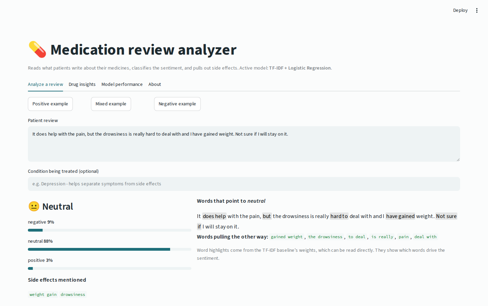
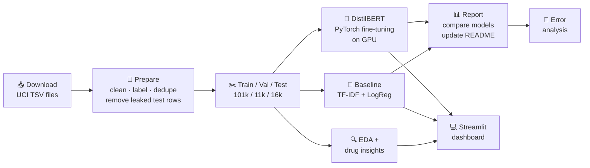
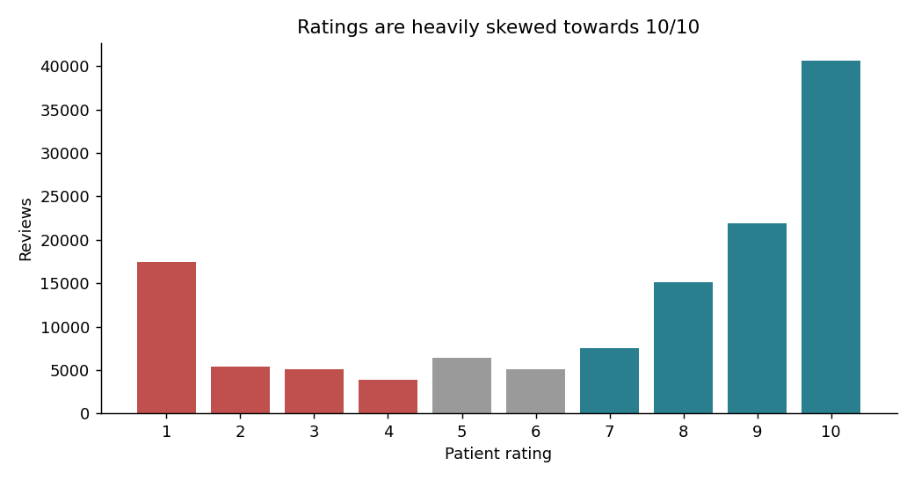
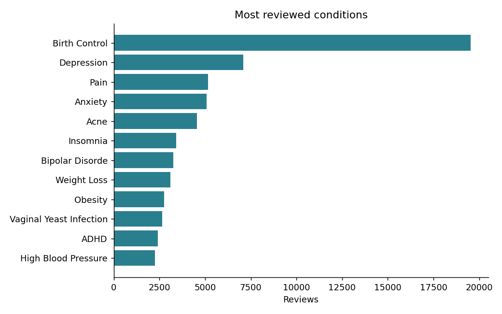
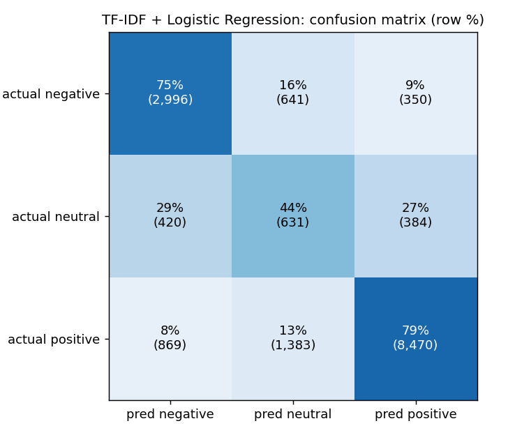
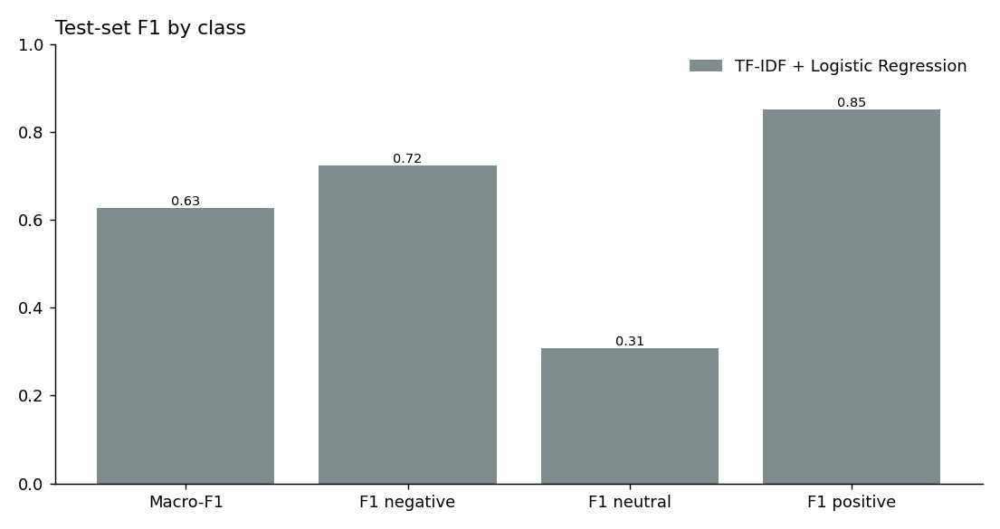
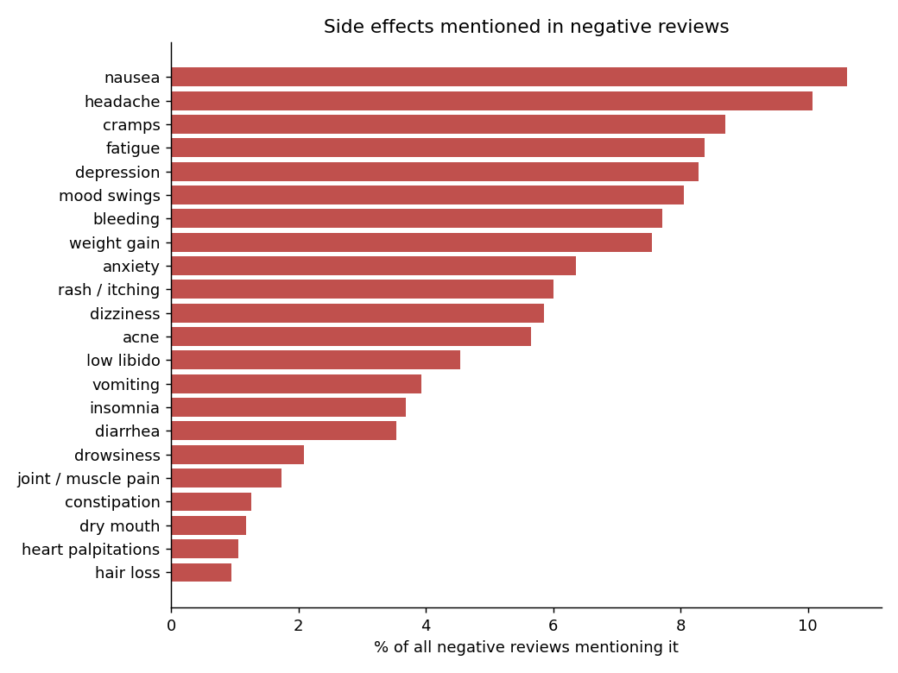
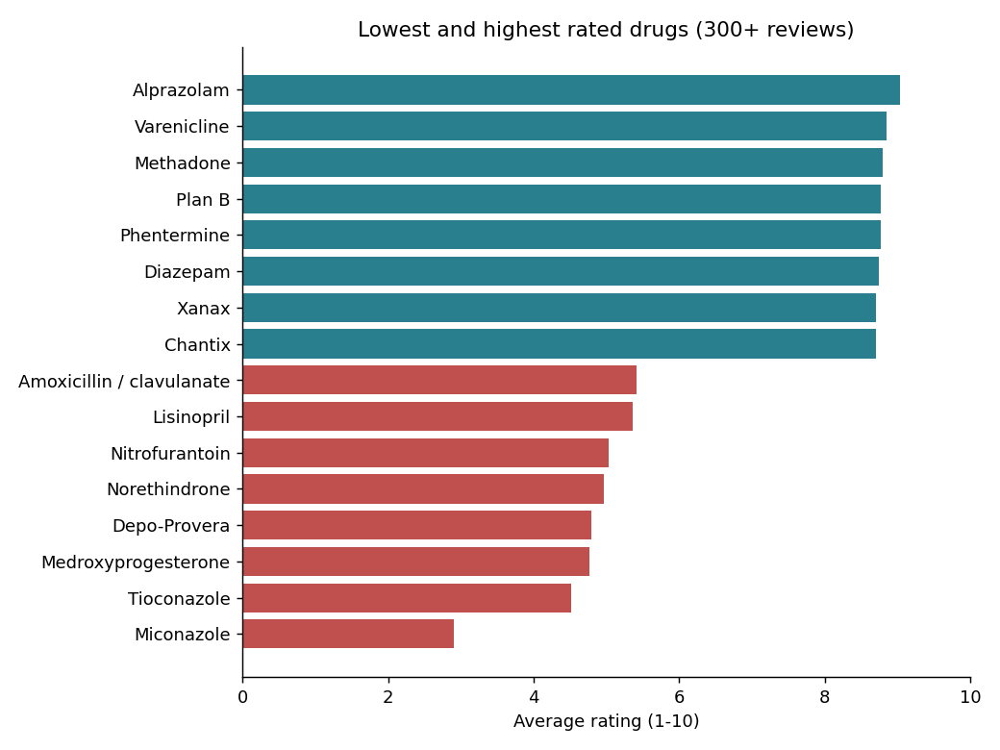
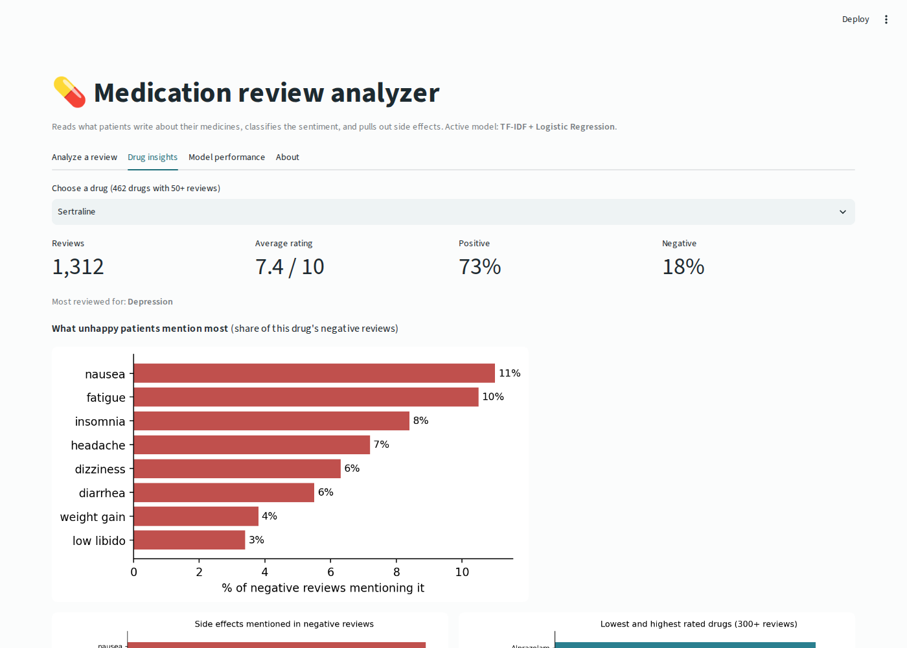

<div align="center">

# 💊 Medication Review Analyzer

**Understanding what patients say about their medicines: sentiment classification with a fine-tuned small language model, plus side-effect insights for 3,000+ drugs.**

TF-IDF baseline ➜ DistilBERT fine-tuned in PyTorch ➜ error analysis ➜ side-effect mining ➜ interactive Streamlit dashboard




</div>

---

## 📑 Table of contents

- [🩺 The problem](#-the-problem)
- [✨ Highlights](#-highlights)
- [📦 Dataset](#-dataset)
- [🏗️ Pipeline architecture](#️-pipeline-architecture)
- [📁 Project structure](#-project-structure)
- [🧹 Step 1: Data preparation and the leakage we found](#-step-1-data-preparation-and-the-leakage-we-found)
- [🔍 Step 2: Exploratory analysis](#-step-2-exploratory-analysis)
- [📏 Step 3: Baseline: TF-IDF + Logistic Regression](#-step-3-baseline-tf-idf--logistic-regression)
- [🧠 Step 4: Small language model: fine-tuning DistilBERT](#-step-4-small-language-model-fine-tuning-distilbert)
- [📊 Results](#-results)
- [🔬 Step 5: Error analysis](#-step-5-error-analysis)
- [💊 Step 6: Side-effect insights per drug](#-step-6-side-effect-insights-per-drug)
- [💻 Step 7: Interactive dashboard](#-step-7-interactive-dashboard)
- [🚀 Getting started](#-getting-started)
- [⚡ Fine-tune DistilBERT on a free GPU](#-fine-tune-distilbert-on-a-free-gpu)
- [🧪 Tests and CI](#-tests-and-ci)
- [⚖️ Limitations](#️-limitations)
- [🔮 Future work](#-future-work)
- [📚 References](#-references)
- [👤 Author](#-author)

---

## 🩺 The problem

Pharmacies, insurers and drug manufacturers collect huge amounts of **free-text patient feedback**. Nobody can read it all, yet it holds exactly what matters:

- 😟 Which drugs patients are **unhappy** with
- 🤢 Which **side effects** drive that unhappiness
- 💊 Signals that a patient may **stop taking** a medication (non-adherence costs health systems billions every year)

This project reads patient reviews automatically. It **classifies each review as negative, neutral or positive** and **summarises the side effects patients mention for each drug**, so a pharmacy or benefits team can see at a glance where patient experience is poor and why.

---

## ✨ Highlights

| | |
|---|---|
| 🛡️ **Found and fixed real data leakage** | 32,131 of the official test reviews are exact copies of training reviews. All removed before evaluation |
| 📏 **Strong, interpretable baseline** | TF-IDF (words + word pairs) + Logistic Regression with class balancing, tuned on validation |
| 🧠 **Small language model** | DistilBERT (66M parameters) fine-tuned with a **hand-written PyTorch training loop**: AdamW, warmup + linear decay, mixed precision, gradient clipping, best-checkpoint selection |
| ⚖️ **Imbalance-aware** | Macro-F1 as the headline metric, class-weighted loss for the rare neutral class |
| 🔬 **Error analysis** | Where and why the model fails: borderline ratings, mixed "worked BUT..." reviews, review length |
| 💊 **Side-effect mining** | Condition-aware lexicon across 22 side effects and 3,175 drugs (it does not count "depression" as a side effect for an antidepressant) |
| 💻 **Dashboard** | Classify any review, see the words behind the prediction, explore any drug's side-effect profile |
| 🔁 **Reproducible** | One command runs the pipeline, a GPU notebook runs fine-tuning for free, 15 unit tests, GitHub Actions CI |

---

## 📦 Dataset

**[Drug Review Dataset (Drugs.com)](https://archive.ics.uci.edu/dataset/462)**, UCI Machine Learning Repository (CC BY 4.0)

| Property | Value |
|---|---|
| Raw reviews | 215,063 (official train 161,297 + test 53,766) |
| Unique reviews after cleaning | **128,456** |
| Drugs / conditions | 3,175 drugs, 831 conditions |
| Fields | drug name, condition, free-text review, 1–10 rating, date, useful-vote count |
| Median review length | 84 words |

**Labels from ratings:** 1–4 → 😟 negative, 5–6 → 😐 neutral, 7–10 → 😊 positive.
**Class balance (train):** positive 66.3%, negative 24.8%, neutral 8.9% ⚠️ imbalanced.

The dataset downloads automatically; it is not stored in the repo.

---

## 🏗️ Pipeline architecture



---

## 📁 Project structure

```
medication-review-analyzer/
│
├── 📄 main.py                        # ▶️ runs the whole pipeline (or one step)
├── 📄 requirements.txt
├── 📄 README.md
├── 📄 LICENSE
│
├── 📂 src/
│   ├── config.py                     # every path + setting in one place
│   ├── 📂 data/
│   │   ├── download_data.py          # step 1: fetch the dataset
│   │   └── prepare.py                # step 2: clean, label, dedupe, leakage fix, split
│   ├── 📂 analysis/
│   │   ├── eda.py                    # step 3: charts + per-drug insight tables
│   │   └── side_effects.py           # condition-aware side-effect lexicon
│   └── 📂 models/
│       ├── baseline.py               # step 4: TF-IDF + Logistic Regression
│       ├── transformer.py            # step 5: DistilBERT fine-tuning (PyTorch loop)
│       ├── evaluate.py               # shared metrics, confusion matrices
│       ├── report.py                 # step 6: compare models, update README table
│       ├── error_analysis.py         # step 7: where and why the model fails
│       └── predict.py                # one predictor class used by the app
│
├── 📂 app/
│   └── streamlit_app.py              # interactive dashboard
│
├── 📂 notebooks/
│   └── finetune_distilbert_gpu.ipynb # run fine-tuning free on Kaggle / Colab
│
├── 📂 models/                        # baseline model (committed), distilbert/ (git-ignored, 255 MB)
├── 📂 reports/
│   ├── figures/                      # all charts
│   ├── insights/                     # per-drug tables used by the dashboard
│   ├── metrics/                      # one JSON per model
│   ├── predictions/                  # test-set predictions per model
│   ├── model_comparison.csv
│   └── error_analysis.md             # 🔬 readable error report
│
├── 📂 docs/
│   ├── HOW_IT_WORKS.md               # 📘 detailed walkthrough of every file and concept
│   └── assets/                       # screenshots
│
├── 📂 tests/                         # 15 unit tests (incl. a real PyTorch training-loop test)
└── 📂 .github/workflows/tests.yml    # CI on every push
```

---

## 🧹 Step 1: Data preparation and the leakage we found

[`src/data/prepare.py`](src/data/prepare.py)

| Rule | Effect | Why |
|---|---:|---|
| Decode HTML (`&#039;` → `'`), strip quotes, squash spaces | | Raw text is scraped HTML |
| Fix broken conditions (`"3</span> users found this..."`) | → `Unknown` | Scraping artefacts |
| Label from rating (1–4 / 5–6 / 7–10) | 3 classes | Standard sentiment mapping |
| Remove duplicate review texts | train 161,297 → **112,312** | The same review is listed under a brand **and** a generic name (e.g. *Nexplanon* and *Etonogestrel*) |
| 🚨 **Remove test reviews that also appear in train** | **32,131 removed** → 16,144 test reviews | Otherwise the model is graded on reviews it trained on |
| Stratified train / validation split (90 / 10) | 101,080 / 11,232 | Same class shares in every split |

> 💡 **Why this matters:** in the official split, about 60% of test reviews (after removing duplicates within the test file) are word-for-word copies of training reviews. Many published notebooks on this dataset evaluate on that split, which inflates their scores. Every number in this README comes from the cleaned, leak-free test set.

---

## 🔍 Step 2: Exploratory analysis

[`src/analysis/eda.py`](src/analysis/eda.py)

<p align="center">
  
  
</p>

- ⭐ Ratings are **polarised**: most patients give 10/10 or 1/10, and few give 5–6. This is why the neutral class is small and hard.
- 🩺 Birth control, depression, pain and anxiety dominate the reviews.
- 📝 Reviews are fairly long (median **84 words**), so the model sees a lot of context.

---

## 📏 Step 3: Baseline: TF-IDF + Logistic Regression

[`src/models/baseline.py`](src/models/baseline.py)

- **TF-IDF** on single words and word pairs (so `"not good"` is a feature), 50k features, sublinear term frequency
- **Logistic Regression** with `class_weight="balanced"`; regularisation strength `C` picked on the validation set
- Trains in about 3 minutes on a laptop CPU

It is fully interpretable. These are the words it learned for each class:

| Class | Top words learned by the model |
|---|---|
| 😟 Negative | *worse, not recommend, not, worst, horrible, never, not worth, disappointed, terrible* |
| 😐 Neutral | ***however, but**, was great, **yet**, helps with, **although**, hoping, hopefully, **though*** |
| 😊 Positive | *love, great, amazing, miracle, best, works, love it, years, no side, life* |

The neutral class is defined by **contrast words**. Neutral reviews say "it helps, *but*...". That one observation explains most of the errors later.

---

## 🧠 Step 4: Small language model: fine-tuning DistilBERT

[`src/models/transformer.py`](src/models/transformer.py)

**DistilBERT** is a compressed version of BERT: 40% smaller and 60% faster, keeping about 97% of its language understanding. Unlike TF-IDF, it reads words **in context**: it knows *"not bad at all"* is positive and that *"but"* changes the meaning of what comes before it.

Fine-tuning is written as a **plain PyTorch loop** (no `Trainer` black box), so every step is visible:

| Component | Choice | Why |
|---|---|---|
| Tokenisation | per-batch, dynamic padding, max 256 tokens | Pads only to the longest review in each batch, which saves compute |
| Loss | Cross-entropy with **√-inverse class weights** | Gives the rare neutral class more weight without over-predicting it |
| Optimiser | AdamW, lr 3e-5, weight decay 0.01 (not on bias/LayerNorm) | Standard for fine-tuning transformers |
| Schedule | 6% linear warmup, then linear decay | Avoids destroying pretrained weights early |
| Speed | Mixed precision (`torch.autocast` + `GradScaler`) on GPU | About 2× faster |
| Stability | Gradient clipping at 1.0 | Prevents exploding gradients |
| Model selection | Evaluate every epoch, keep the best **validation macro-F1** checkpoint | The test set is used only once |

Runs in roughly 30–45 minutes on a free Kaggle/Colab T4 GPU; [see below](#-fine-tune-distilbert-on-a-free-gpu).

---

## 📊 Results

On the **leak-free test set** (16,144 reviews the models never saw):

<!-- RESULTS_TABLE_START -->
| Model | Accuracy | Macro-F1 | F1 negative | F1 neutral | F1 positive |
|---|:---:|:---:|:---:|:---:|:---:|
| TF-IDF + Logistic Regression | 0.749 | 0.628 | 0.724 | 0.309 | 0.850 |
| DistilBERT (fine-tuned) | *run on GPU* | *see below* | | | |
<!-- RESULTS_TABLE_END -->

> 🔄 **This table updates itself.** After fine-tuning DistilBERT on a GPU, `python main.py --step report` writes its real scores here and draws the comparison chart.

**Reading the baseline:**
- ✅ Strong on clear positive (F1 0.85) and negative (F1 0.72) reviews.
- ⚠️ Weak on **neutral** (F1 0.31). A bag of words cannot tell *"helps but side effects"* (neutral) from *"side effects at first but now it helps"* (positive). Context is exactly what DistilBERT adds.

<p align="center">
  
  
</p>

---

## 🔬 Step 5: Error analysis

[`src/models/error_analysis.py`](src/models/error_analysis.py) → full report in [`reports/error_analysis.md`](reports/error_analysis.md)

*Numbers below are for the baseline. After fine-tuning, `python main.py --step errors` re-runs the analysis on DistilBERT's predictions.*

| Finding | Evidence |
|---|---|
| 🎯 **Errors cluster on borderline ratings** | **38%** of errors come from ratings 4–7, which are only 17% of the test set. A 6/10 and a 7/10 often read the same, so part of this is label noise, not model error |
| ⚖️ **Mixed reviews are hardest** | Accuracy **70.7%** on reviews with contrast words (*but, however, although*) vs **80.4%** without |
| 🔁 **Most common mistake** | true positive → predicted neutral (34% of errors): class balancing makes the model eager to call mixed-sounding positives neutral |

This analysis is what motivates the transformer: the errors are about **context and contrast**, which word counts cannot capture.

---

## 💊 Step 6: Side-effect insights per drug

[`src/analysis/side_effects.py`](src/analysis/side_effects.py)

A transparent lexicon of **22 side effects** is matched against negative reviews. It is **condition-aware**: for a patient treated for depression or anxiety, mentions of depression, anxiety or mood are not counted as side effects (they are the condition, not a reaction to the drug).

<p align="center">
  
  
</p>

Examples of what it surfaces:
- **Sertraline** (antidepressant): unhappy patients most often mention nausea (11%), fatigue (10%) and insomnia (8%), matching its known side-effect profile.
- **Etonogestrel** (contraceptive implant): bleeding (45% of negative reviews), mood swings, weight gain.
- **Lowest rated** drugs with 300+ reviews include Miconazole and Depo-Provera; **highest rated** include Alprazolam and Varenicline.

---

## 💻 Step 7: Interactive dashboard

[`app/streamlit_app.py`](app/streamlit_app.py)

- 📝 **Analyze a review:** paste any review and get its sentiment with probabilities, the words behind it highlighted, and the side effects it mentions.
- 💊 **Drug insights:** pick any of 462 drugs with 50+ reviews and see its rating, sentiment split and what unhappy patients complain about.
- 📊 **Model performance:** comparison table, confusion matrices, full error report.

The app automatically uses DistilBERT if `models/distilbert/` exists, otherwise the baseline.

<p align="center">
  
</p>

---

## 🚀 Getting started

### 1️⃣ Clone and set up (Python 3.11+)

```bash
git clone https://github.com/<your-username>/medication-review-analyzer.git
cd medication-review-analyzer

python -m venv venv
venv\Scripts\activate          # Windows
# source venv/bin/activate     # macOS / Linux

pip install -r requirements.txt
```

### 2️⃣ Run the pipeline (≈ 4 minutes on a laptop)

```bash
python main.py
```

This downloads the data, prepares it, runs EDA and drug insights, trains the baseline, compares models and runs error analysis. The DistilBERT step runs automatically if a GPU is available; otherwise it is skipped with instructions.

```bash
python main.py --step baseline     # one step
python main.py --from eda          # from a step onward
```

### 3️⃣ Launch the dashboard

```bash
streamlit run app/streamlit_app.py
```

> The trained baseline is included in `models/`, so the dashboard works straight after cloning. It was saved with scikit-learn 1.8; if your version differs, the app asks you to run `python main.py --step baseline` once.

---

## ⚡ Fine-tune DistilBERT on a free GPU

1. Open [`notebooks/finetune_distilbert_gpu.ipynb`](notebooks/finetune_distilbert_gpu.ipynb) in **Kaggle** (enable *GPU T4* and *Internet*) or **Colab** (*T4 GPU* runtime).
2. Run all cells. They clone this repo, prepare the data, fine-tune DistilBERT, compare models and run error analysis.
3. Download `reports.zip`, unzip it into your local repo, and commit it. Your README results table and charts are now updated with real DistilBERT numbers.
4. *(Optional)* Download `distilbert.zip` and unzip it into `models/` to use DistilBERT in your local dashboard. It is 255 MB, so it stays out of Git.

---

## 🧪 Tests and CI

```bash
pytest -v
```

15 tests cover text cleaning, rating labels, **de-duplication and leakage removal**, the side-effect lexicon (whole-word matching, condition awareness), the baseline, and a **real PyTorch training-loop test**: it builds a tiny DistilBERT-shaped model locally (no download) and trains it end to end. **GitHub Actions** runs everything on every push.

---

## ⚖️ Limitations

- ⭐ **Ratings are noisy labels.** Patients rate differently, and 6 vs 7 is often arbitrary.
- 🔤 **The side-effect lexicon finds mentions, not causes.** It cannot tell "I got headaches" from "it cured my headaches" in every case. Treat it as a signal for further review.
- 🌐 **Self-selected reviewers.** People with strong experiences are more likely to post, so ratings are polarised.
- 🧪 **Educational project.** Not medical advice, not validated for clinical or regulatory use.

---

## 🔮 Future work

- [ ] Aspect-based sentiment: separate *effectiveness* from *side effects* in one review
- [ ] Replace the lexicon with a token-classification model (NER) for side effects
- [ ] Predict rating as regression and compare with 3-class classification
- [ ] Publish the fine-tuned model to the Hugging Face Hub and deploy the app
- [ ] Try other small language models (MiniLM, DeBERTa-v3-small) and compare speed vs accuracy

---

## 📚 References

1. Gräßer, F., Kallumadi, S., Malberg, H., & Zaunseder, S. (2018). *Aspect-Based Sentiment Analysis of Drug Reviews Applying Cross-Domain and Cross-Data Learning.* Proceedings of the 2018 International Conference on Digital Health. (dataset)
2. Sanh, V., Debut, L., Chaumond, J., & Wolf, T. (2019). *DistilBERT, a distilled version of BERT: smaller, faster, cheaper and lighter.* arXiv:1910.01108.
3. Devlin, J., Chang, M.-W., Lee, K., & Toutanova, K. (2019). *BERT: Pre-training of Deep Bidirectional Transformers for Language Understanding.* NAACL.
4. Loshchilov, I., & Hutter, F. (2019). *Decoupled Weight Decay Regularization.* ICLR. (AdamW)
5. [UCI ML Repository: Drug Review Dataset (Drugs.com)](https://archive.ics.uci.edu/dataset/462)

---

## 👤 Author

**Rahul Rajora**
🎓 B.Tech Computer Science & Engineering, Delhi Technological University (2023–2027)

[](https://github.com/<your-username>)
[](https://www.linkedin.com/in/<your-linkedin>)

<div align="center">

⭐ If you found this project useful, consider giving it a star!

</div>
